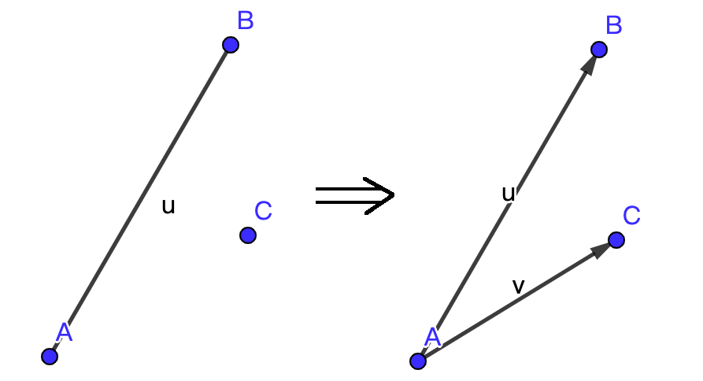

# 计算几何入门
## 不能再基础的内容
### 两点之间的距离
目前已知的，常规的计算方式有三种：

1. 直线距离: $\sqrt{(x_1-x_2)^2+(y_1-y_2)^2}$
2. 切比雪夫距离（貌似有些神奇的性质）：$\min\{|x_1-x_2|,|y_1-y_2|\}$
3. 曼哈顿距离（可以构成正方形）：$|x_1-x_2|+|y_1-y_2|$

计算几何一般都是考虑直线距离

### 各种基本图形的面积

计算几何用的比较多的是圆的面积，这里说一下，$\pi$的计算方法可以使用：
$$
\pi=acos(-1)
$$
精度较高。
正方形的面积不必说，而三角形的面积可以使用海伦公式：
$$
S=\sqrt{s(s-a)(s-b)(s-c)}\\
其中s={a+b+c\over 2}
$$
但我们一般不会用这玩意。
## 向量(Vector)
这个东西和``C++``的动态数组没有半毛钱关系。

一个向量可以认为是一条有方向的线段，我们一般将一个向量考虑成一个点抱另一个点的位移，用$\overrightarrow{AB}$表示。

正因为是有方向的，所以$\overrightarrow{AB}$和$\overleftarrow{AB}$是两个不一样的向量。

一个二维平面的向量可以用二元组$(x,y)$来描述。

接下来定义向量的各种运算：

加法：$(x_1,y_1)+(x_2,y_2)=(x_1+x_2,y_1+y_2)$。

减法：$(x_1,y_1)-(x_2,y_2)=(x_1-x_2,y_1-y_2)$

叉积：$(x_1,y_1)*(x_2,y_2)=x_1y_2-y_1x_2$

目前本人已知叉积的典型用法有两种：
$$
|\overrightarrow{AB}*\overrightarrow{AC}|=2S_{\Delta{ABC}}
$$
上面的式子用人话来讲就是：叉积的绝对值等于两个向量作为邻边构成的平行四边形的面积，等于以向量的三个点构成的三角形面积的两倍。

叉积的第二个用法是用来判别方向：如果叉积$>0，$那么说明$\overrightarrow{AB}$到$\overrightarrow{AC}$是顺时针旋转的，如果$<0$，就说明是逆时针旋转的，如果$=0$那么就说明这两个向量方向相同。

其他东西暂时不会用到。

### 小应用
**判断一个点P在线段的左侧还是右侧**

很显然，可以对其进行转化：

PS：两点构建向量的方式就是两点横纵坐标相减。

可以发现，只要首先使用线段上的两个点，构建一个从较低点到较高点的向量，然后构建一个从较低点到点$P$的向量，然后两个向量做叉积就能得到方向了。

**判断一个点P是否在三角形内**

一个简单做法如下：
$$
定义大小关系只有三种：大于，小于，等于\\
对于\Delta{ABC},\\
w_1=\overrightarrow{AB}*\overrightarrow{AP},\\
w_2=\overrightarrow{BC}*\overrightarrow{BP},\\
w_3=\overrightarrow{CA}*\overrightarrow{CP},\\
如果w_1,w_2,w_3中存在一个和0的大小关系不同\\
那么P不在\Delta ABC中\\
否则在\Delta ABC中
$$

**[$\Rightarrow$小例题](http://poj.org/problem?id=2398)**