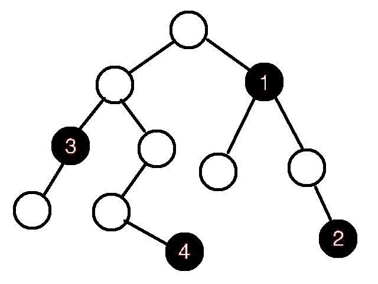
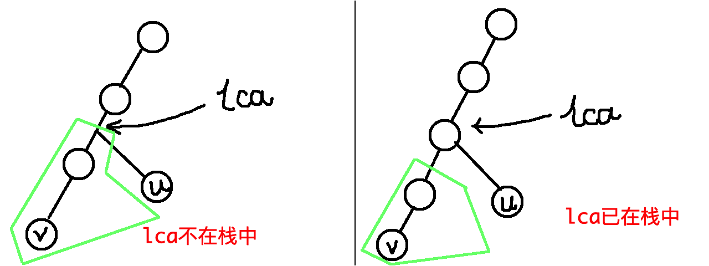
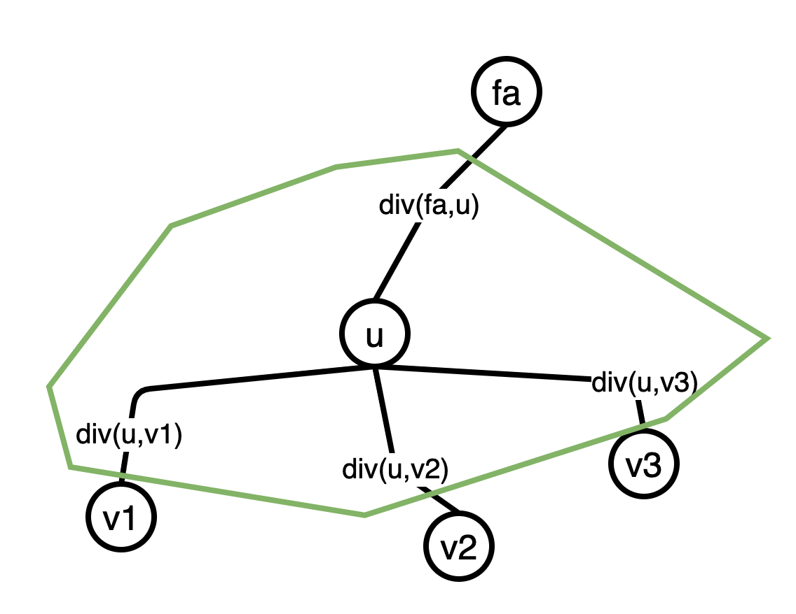

# 蒟蒻讲虚树

## 什么是虚树

虚树其实就是将一颗树化简，只保留关键信息，所得到的一颗新树。

## 用例题引入[LUOGU-P2495 消耗战]

### 题意

给定一颗含有$n$个节点的树，切断树上的每一条边$e$都有一个代价$w(e)$,现在有$m$次询问，每一次给出$k$个关键节点，每个询问回答使得根节点$1$不能到达所有关键节点的最小费用

$n\leq 2.5\times 10^5, m\leq 5\times 10^5$

划重点：$\sum_{i=1}^m k_i\leq 5\times 10^5$


### 从暴力开始

考虑树形dp，可以得到：
$$
f(u)=\sum\limits_{v\in son_u} 
\begin{cases}
\min\{f(v), w(u,v)\} & v~~isn't~~a~~key~~node\\
w(u,v) &v~~is~~a~~key~~node
\end{cases}
$$
显然叶子结点的$f(u)=0$，最终答案为$f(1)$。

这样的复杂度为$O(n)$。

### 引入虚树

可以发现，询问的节点数总和最多为$2n$个，也就说只要我们$O(k)$处理每一次询问，就能通过此题。

现在考虑这样的一张图（下面），其中黑色的点为关键节点。



可以发现，节点1,2之间的路径可以化简，因为我们一定会选择删除这两个节点之间最短的那条边（其实对于本题而言，2节点根本不会参与计算）。

同时要保存根节点到1的边。

节点3，4并不是祖先关系，所以说有两种选择：

1. 删除$lca(3,4)$和根节点之间最短的边
2. 同时删除$lca(3,4)\rightarrow 3$和$lca(3,4)\rightarrow 4$这两条路径上最短的边

所以说节点$3,4$和他们的最近公共祖先必须保留下来。

这里可以根据感觉得到一些虚树的特征：根节点，关键节点和所有关键节点之间的$lca$需要保存下来，剩余节点可以省略。虚树的一条边$(u,v)$的边权是原树上这两个节点的路径上的某些内容。

可以证明，虚树的节点数量小于等于关键节点数量的两倍。

### 构建虚树

考虑用栈维护虚树上的一条链。依次连接栈中相邻的两个节点可以得到一条从栈顶节点到根节点的路径，而且栈中的所有点都必须被加入虚树，但可能不是真正得到的虚树路径。

首先将根节点压入栈中。接着将所有关键节点按照dfs序从小到大加入，每次加入关键节点都要做类似下面的操作：

设需要加入的节点为u,栈顶的节点v和$u$在原图中的$lca$为$L$。

- 如果$L=v$，那么说明v是u的祖先，可以直接将u加入栈中，将栈中维护的链拉长。

- 如果$L\ne v$，那么当前栈维护的一部分虚树是下面图中显示的其中一个：

  
  因为当前栈中保存的所有节点都是必须加入虚树中的。而现在出现了点$u$,那么就是说明绿色框框的地方不会再出现新的关键节点需要加入了（因为我们按关键节点的dfs序加入关键节点）这表明从$lca$到$v$的路径可以被固定下来。所以我们依次连接$v\rightarrow L$上的所有在栈上的点，从栈中删除绿色框框中的点，对于左图上的情况，还需要把$L$加入栈中。最后加入节点$u$即可。

**加入了所有关键节点之后，栈中保留了一条从根节点到最后一个关键节点的路径（此时这条路径已经完整），记得把这条路径加入虚树。**

写一个简单的代码，其实蛮好理解的，而且调试难度也蛮小的：

```cpp
struct Graph {
    struct Edge {
        int v, nex;
        Edge(int v, int nex) : v(v), nex(nex) {}
    } E[maxn << 1];
    
    int hd[maxn], tchk[maxn]/*时间标记，懒人写法*/, tote, ti/*实际上表示这是第几次建立虚树*/;
    
    void addedge(int u, int v, int w) {
        if (tchk[u] != ti) tchk[u] = ti, hd[u] = 0;
        if (tchk[v] != ti) tchk[v] = ti, hd[v] = 0;
        E[++tote] = Edge(v, w, hd[u]), hd[u] = tote;
        E[++tote] = Edge(u, w, hd[v]), hd[v] = tote;
    }
  	void destroy() { tote = 0, ti++; }
} G, vG;
bool cmp(int a, int b) { return dfn[a] < dfn[b]; }
void build_vG() {
    sort(knd + 1, knd + 1 + knd_sz, cmp), vG.destroy(), stk[stk_sz = 1] = 1;
    for (int i = 1; i <= knd_sz; i++) {
        if (knd[i] == 1) continue; //不能重复加入
        int u = knd[i], v = stk[stk_sz], lca = get_lca(u, v);
        if (lca == v) stk[++stk_sz] = u;
        else {
            while (stk_sz > 1 && dep[lca] <= dep[stk[stk_sz - 1]])
                vG.addedge(stk[stk_sz - 1], stk[stk_sz]), stk_sz--;
            if (lca != stk[stk_sz])
                vG.addedge(lca, stk[stk_sz]), stk[stk_sz] = lca;
            stk[++stk_sz] = u;
        }
    }
    for (int i = stk_sz - 1; i >= 1; i--) vG.addedge(stk[i], stk[i + 1]);
}
```

### 解决例题

重新看看这道题目，其实就是首先预处理一下倍增所用的数组，在构建虚树的时候，虚树边的边权就是两点间的最短边，用倍增求出lca和最短边。接着跑一遍上面说的暴力的dp就好啦。**（记得开longlong）**

## [LUOGU-P4103 大工程]

### 题意

给定一棵有n个节点的树，同样是m次询问，每次同样给定k个节点
问给定的节点组成的$C(k,2)$条路径的长度之和，最长的路径和最短的路径。
$$
n\leq 10^6~~~~~m\leq 5\times 10^4~~~~~\sum\limits_{i=1}^m k_i\leq 2n
$$

### 简单分析

直接对于每个询问建立虚树，每条边记录对应的链的长度。

对于第一问，可以转化为每条边的长度乘以这条边经过的次数，次数就是子树中关键点个数再乘上子树外关键点的个数。

对于第二问，用类似于求树的直径的算法，记录最大值和次大值。

第三问和第二问差不多。

## [CF613D Kingdom and its Cities]

### 题意

给定一棵树，每次询问又给出k个关键节点，现在需要删除最少的点让所有关键节点不能相互到达，关键节点不能被删除。无解输出”-1”
$$
n\leq 10^5, m\leq 10^5, \sum\limits_{i=1}^m k_i\leq 10^5
$$

### 简单题解

设$f(u,0/1)$表示在子树$T(u)$中，是否存在一个关键节点和u联通，所需要删除的最少节点。

可以得到：
$$
\begin{aligned}
&如果u是关键节点\\
&f(u,1)=\sum\limits_{v\in vson_u}f(v,0), ~~~f(u,0)=\infty\\
&如果u不是关键节点\\
&枚举子树时：\\
&f'(u,1)=\min\{f(u,0)+f(v,1),f(u,1)+f(v,0)\}\\
&f'(u,0)=f(u,0)+f(v,0)\\
&枚举结束之后：\\
&f(u,0)=\min\{f(u,0),\sum\limits_{v\in vson_u} \min\{f(v,0),f(v,1)\}+1\}\\
&如果d_{u}-d_{fa}>1\\
&f(u,0)=\min\{f(u,0), f(u,1)+1\}
\end{aligned}
$$

## [LUOGU-P3233世界树]

### 题意

给定一颗大小为N的树，每条边的长度都为1，同样是q个询问，同样每次给m个红点。

每一次询问中，每一个点会被离它最近的红点覆盖，如果有多个红点和它距离相等，选择编号最小的，红点自己覆盖自己。需要回答每个红点覆盖的节点数。
$$
N\leq 3\times 10^5, q\leq 3\times 10^5,\sum_{i=1}^q m_i\leq 3\times 10^5
$$

### 分析

首先建立虚树。

每一个节点计算出$\mathrm{blg}_u, \mathrm{d}_u$，分别表示这个节点被谁覆盖，距离这个点的距离。显然这两个值可以使用一次由儿子到父亲的dfs和一次从父亲到儿子的dfs完成计算。

接着观察虚树中的一条边$(u,v)$，它对应了原树中的一条链。

- 若$\mathrm{blg}_u = \mathrm{blg}_v$,那么两个节点之间的所有节点（不仅是链，还有连在链上的某些节点）都是会贡献到$\mathrm{blg}_u$.
- 若$\mathrm{blg}_u\ne\mathrm{blg}_v$，那么这些节点就会被分成两部分，分别贡献到$\mathrm{blg}_u,\mathrm{blg}_v$，这个分界点和其中一个点的距离很好求，所以可使用倍增向上跳跃求出这个分界点。

设$\mathrm{div}(u,v)$表示有虚树边连接的两个点，v深度较大，如果$\mathrm{blg}_u=\mathrm{blg}_v$,则$\mathrm{div}(u,v)=v$,$\mathrm{div}(u,v)$，贡献到$\mathrm{blg}_v$，考虑虚树中一个点u对$\mathrm{blg}_u$的贡献，它贡献的范围就像下面的图中绿色的框框里的点：

那么该点的贡献方式如下，($\mathrm{sz}_u$表示原树中子树$T(u)$的点的个数)：
$$
\mathrm{ans}_{\mathrm{blg}_u}+=\mathrm{sz}_{\mathrm{div}(\mathrm{fa}_u,u)}-\sum\limits_{v\in \mathrm{vson}_u} \mathrm{sz}_v
$$

## [NHOI/AHOI2018 毒瘤]

### 题意

给定一个n个节点，m条边的无向连通图，选择一些节点，要使任意两个节点不连通，问方案数。
$$
n\leq 10^5, n-1\leq m\leq n+10
$$

### 分析

对于$m=n-1$的情况，使用树形dp即可$O(n)$求出答案。
$$
\begin{aligned}
f(u,0)&=\prod\limits_{v\in\mathrm{vson}_u}(f(v,0)+f(v,1))\\
f(u,1)&=\prod\limits_{v\in\mathrm{vson}_u}f(v,0)
\end{aligned}
$$
对于$m=n$的情况，可以随意生成一颗生成树，然后枚举那条非树边两端节点的选择情况$(1,0)(0,1)(0,0)$可以发现，如果限制了第一个点不选择，那么第二个点选或不选都是合法情况，而如果第一个点选择了，那么第二个点必须不选择，所以选择情况可以合并为两种$(0,1/0),(1,0)$。

对于其他情况，考虑暴力枚举每一条非树边的选择情况，然后每个情况都做一次dp，然后统计结果。显然会超时。

可以发现，其实非树边限制的点很少，最多$2(m-n+1)$个，所以很多节点的值会被重复算，而观察暴力的转移方程，可以发现可以将转移分开几部分，然后再乘起来，所以我们建立虚树，每个虚树中的点算出该点向其虚树中的父亲转移的参数$k(u,0/1,0/1)$，表示虚树父亲是否选择，节点u是否选择的参数。而每个dp状态还要算上那些没有在参数计算的时候涉及到，同时没有加入虚树的点。

[代码](https://www.luogu.com.cn/paste/3u16og3m)

代码注释：

```
knd：			关键节点序列
hvknd[u]：		子树T(u)中包含的关键节点数量
f(u,0/1)：		虚树边所代表的虚树链上的dp，不包含链上的点，只包含分叉
of(u,0/1)：		不被虚树dp计算的所有点的dp，这个点的子树内部不包含任何存在于虚树的点
g(u,0/1,0/1)：	转移参数
vf(u,0/1)：		虚树的dp
```

## [LUOGU-P4242 树上的毒瘤]

### 题面

这棵树上有$n$个节点，由$n−1$条树枝相连。初始时树上都挂了一个毒瘤，颜色为$c_i$。接下来Salamander将会进行$q$个操作。

Salamander有时会修改树上某个点到另外一个点的简单路径上所有毒瘤的颜色。

对于给定的树上某个点集$S$，Salamander还定义了某个点的权值：$W_i=\sum\limits_{j\in S} T(i,j)$,其中$T(i,j)$表示i*i*到j*j*的路径上毒瘤颜色的**段数**，比如$i$到$j$的路径上毒瘤颜色为$1223312$时，颜色段数为$5$。

Salamander对树上的毒瘤们的状态很感兴趣，所以有时会指定树上$m$个节点作为点集，询问这$m$个节点的权值。
$$
n, q\leq 10^5, \sum\limits_{i=1}^q m_i\leq 2\times 10^5, m\leq n
$$


### 题解

对于树上一条路径$(u,v)$的$T(u,v)$，可以使用树剖+线段树解决，线段树的每个节点记录左右端点的颜色和这个节点代表的线段的颜色。

接下来对于每个询问，构建虚树，使用点分治计算经过重心$wr$的路径情况，对于前i个子树，记录两个值：$\mathrm{psum,pcnt}$，表示这i棵子树中路径数和所有关键节点的$T(u,wr)$的总和，若wr也是一个关键节点，则需要对这两个值的初始化做一些修改。假设现在使用dfs计算第i+1颗子树中的节点，假设现在需要计算关键节点u，那么这个节点的答案就加上：$\mathrm{pcnt} \times (T(u,wr)-1)+\mathrm{psum}$，当完成第i+1颗子树的计算时，用这颗子树的内容更新那两个值。我们还需要从后往前再做一遍计算。其中还有一些小细节，就留给dalao们搞定啦。

[代码](https://www.luogu.com.cn/paste/p1pr9rck)

## [CF809E Surprise me!]

### 题意

给出一颗含有$n$个节点的树，每条边的长度都为$1$,每个点$i$有一个权值$a_i$,保证$a_{1}, a_{2}...a_{n-1},a_n$是1到n的一个排列，现在需要求出式子：
$$
{1\over n(n-1)} \sum\limits_{i=1}^n\sum\limits_{j=1}^n\varphi(a_i\times a_j)\times dist(i,j)
$$
最终答案对$10^9+7$取模，$n\leq 2\times 10^5$

### 题解

因为全职序列是一个排列，所以我们令$p_i$表示权值为$i$的节点。接着去掉式子开头给出的分式，可以得到：
$$
\sum\limits_{i=1}^n\sum\limits_{j=1}^n \varphi(ij)\times dist(p_i,p_j)
$$
接着想到一个性质：$\varphi(ij)={\varphi(i)\varphi(j)(i,j)\over \varphi((i,j))}$

那么化式子：
$$
\begin{aligned}
&\sum\limits_{i=1}^n\sum\limits_{j=1}^n 
	{\varphi(i)\varphi(j)(i,j)\over \varphi((i,j))} \times dist(p_i,p_j)\\
=&\sum\limits_{d=1}^n {d\over \varphi(d)} 
		\sum\limits_{i=1} ^ {\lfloor{n\over d}\rfloor} 
			\sum\limits_{j=1} ^ {\lfloor{n\over d}\rfloor} 
				\varphi(id)\varphi(jd)[(i,j)=1]\times dist(p_{id}, p_{jd})\\
=&\sum\limits_{d=1}^n {d\over \varphi(d)} 
		\sum\limits_{i=1} ^ {\lfloor{n\over d}\rfloor} 
			\sum\limits_{i=1} ^ {\lfloor{n\over d}\rfloor} 
				\sum\limits_{g|(i,j)}\mu(g) \varphi(id)\varphi(jd)\times dist(p_{id}, p_{jd})\\
=&\sum\limits_{d=1}^n {d\over \varphi(d)} 
		\sum\limits_{g=1}^{\lfloor{n\over d}\rfloor} \mu(g)
			\sum\limits_{i=1} ^ {\lfloor{n\over dg}\rfloor} 
				\sum\limits_{j=1} ^ {\lfloor{n\over dg}\rfloor} 
					\varphi(idg)\varphi(jdg)\times dist(p_{idg}, p_{jdg})\\
=&\sum\limits_{T=1}^n \sum\limits_{d|T} {d\mu({T\over d})\over \varphi(d)}
		\sum\limits_{i=1} ^ {\lfloor{n\over T}\rfloor}
    	\sum\limits_{j=1} ^ {\lfloor{n\over T}\rfloor} 
    		\varphi(iT)\varphi(jT)\times dist(p_{iT}, p_{jT})
\end{aligned}
$$
可以发现，对于$\sum\limits_{d|T} {d\mu({T\over d})\over \varphi(d)}$，可以使用枚举倍数的方式预处理出对于所有$T$的值，我们用$F(T)$表示这个值。

现在考虑后半式子如何求解。可以发现，对于一个$T$,所需要计算的节点只有将欧拉函数看成是树上节点的权值，所以这个式子可以看成是树上路径的权值问题，可以使用点分治，但是复杂度不太行，因此考虑类树形dp。

考虑子树$T(u)$中的贡献，用$f(u)$表示，显然$f(u)$由经过节点$u$的路径贡献，一条路径值计算一次和子树$T(u)$的小子树的贡献组合完成。

现在考虑转移，使用树形dp最常用的思路：子树合并。

现在$T(u)$要合并$T(v)$,显然可以得到下面的式子：

$f(u)=f(u)+f(v)+w(u,v)$，而现在问题就是$w(u,v)$的求解。

对其进行解析，可以得到：
$$
\begin{aligned}
&\sum\limits_{x\in T(u)}\sum\limits_{y\in T(v)} w_x w_y\times dist(x, y)\\
=&\sum\limits_{x\in T(u)}\sum\limits_{y\in T(v)} w_x w_y\times (dist(x,u)+l(u,v)+dist(v,x))\\
=&\sum\limits_{x\in T(u)}\sum\limits_{y\in T(v)}w_x w_y dist(x,u) + w_x w_yl(u,v)+w_x w_y dist(y,v)\\
=&\sum\limits_{x\in T(u)}w_xdist(x,u) \sum\limits_{y\in T(v)} w_y+
	len(u,v)\times \sum\limits_{x\in T(u)} w_x\sum\limits_{y\in T(v)} w_y+
	\sum\limits_{x\in T(u)}w_x \sum\limits_{y\in T(v)} w_ydist(y,v)
\end{aligned}
$$
设$S_g(u)=\sum\limits_{x\in T(u)}w_xdist(x,u),~~~~S_w(u)=\sum\limits_{x\in T(u)}w_x$

那么就可以化简一下：
$$
=S_g(u)S_w(v)+S_w(u)S_w(v)\times len(u,v)+S_w(u)S_g(v)
$$
在合并子树的时候顺便更新一下这两个函数：
$$
\begin{aligned}
S_g(u)&=S_g(u)+S_g(v)+S_w(v)\times len(u,v)\\
S_w(u)&=S_w(u)+S_w(v)
\end{aligned}
$$
最后，由于我们一条路径只进行了一次计算，所以最终答案要乘上$2$。

[代码](https://www.luogu.com.cn/paste/4e88jgsy)

